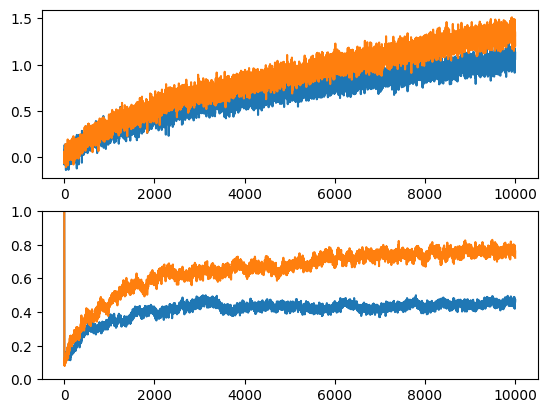

# rl-nonstationary-k-armed-testbed

An experiment to demonstrate the difficulties that sample-average methods have for non-stationary problems.

Implements an &epsilon;-greedy agent with two action-value learning algorithms:
* an action-value method using sample averages.
* an action-value method using a constant step-size parameter, i.e. &alpha; = 1

Uses a modified version of the 10-armed testbed in which all the q*(a) start out equally at zero and then take independent random walks.

# Result

Orange - fixed step
Blue - sample-averaging
Why? Because by using a fixed step, initial values will decay in time. At step n, value 1 contributes (1-&alpha;)^n to the value estimate, rather
than 1/n. With n = 100, that's 2e-5 vs 1e-2. 



# Usage

```
python __main__.py result.out
python ex2_5_plot.py result.out # graphing
```

# Reference 

[Sutton, Richard S., and Andrew G. Barto. Reinforcement learning: An introduction](incompleteideas.net/sutton/book/RLbook2020.pdf)
[https://github.com/jettdlee/10_armed_bandit](https://github.com/jettdlee/10_armed_bandit/)